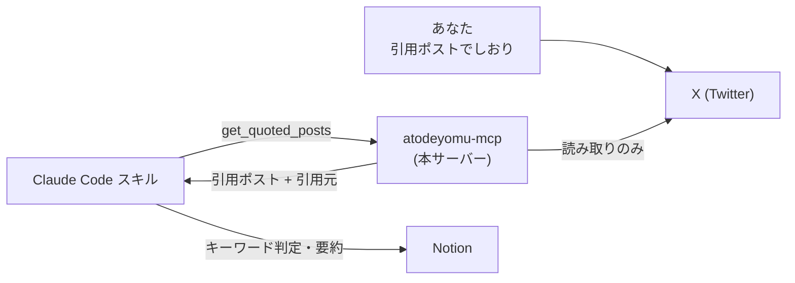
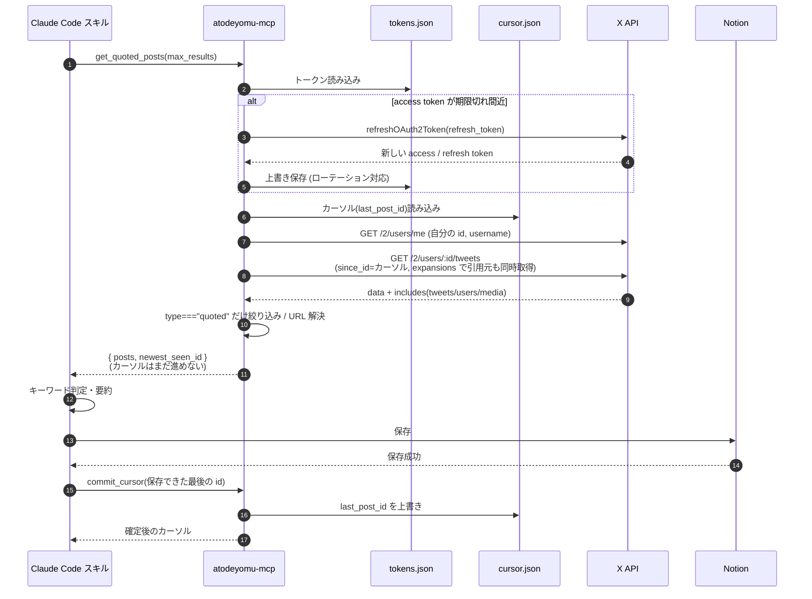
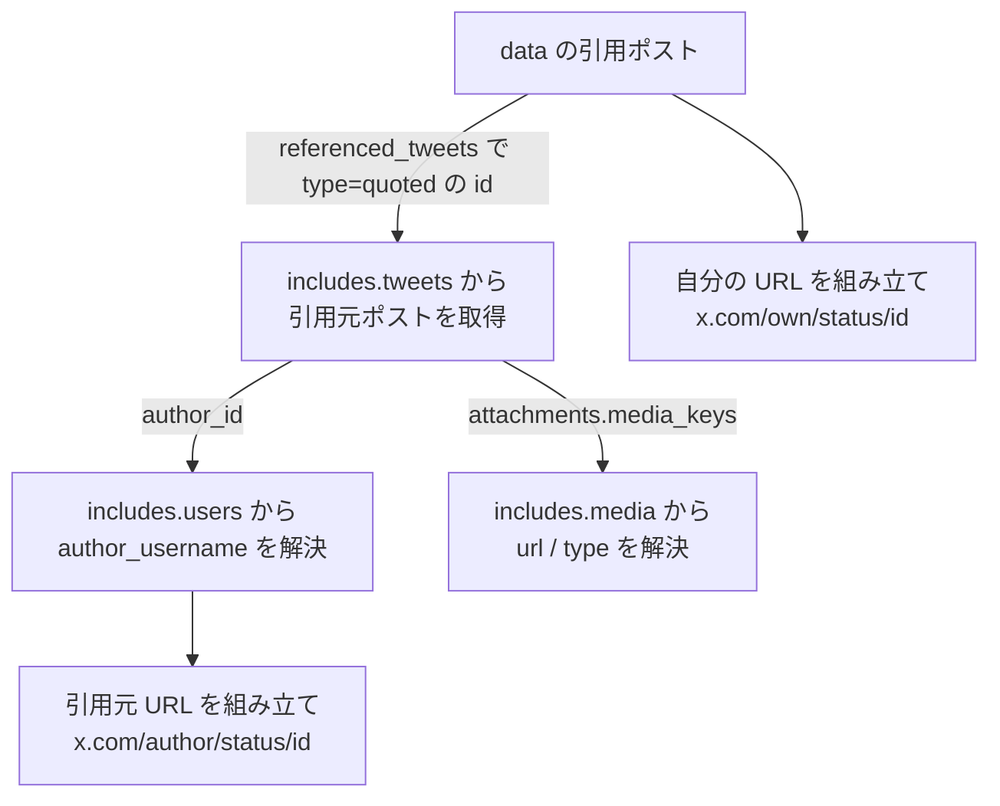
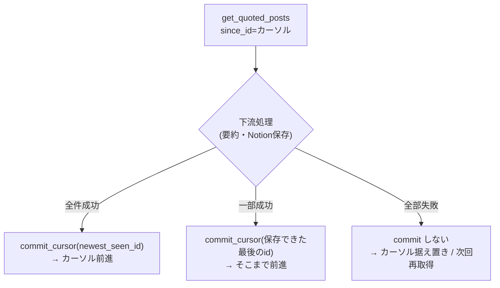
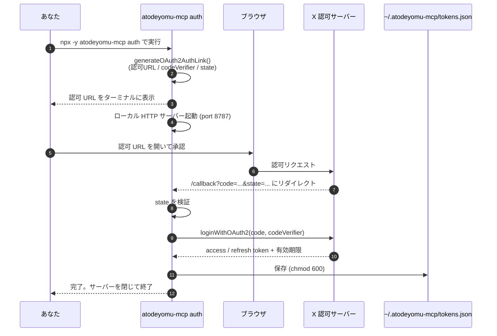

# atodeyomu-mcp 仕様書

> このドキュメントは、Claude Code で開発・保守する人間が読むためのものです。設計の意図とデータの流れを図とともに説明します。実装の正は [DESIGN.md](./DESIGN.md) を参照してください。

## 1. これは何か

X (Twitter) で「あとで読む」つもりで **引用リツイート（引用ポスト）** したものを、後からまとめて拾い上げるための MCP サーバーです。

普段の使い方はこうです。気になる投稿を見つけたら、一言コメントを添えて引用ポストする（これが「あとで読む」のしおり代わり）。あとで Claude Code のスキルがこの MCP を呼び、引用ポストとその引用元をまとめて取得し、要約して Notion に保存する——という知識管理パイプラインの **入口（データ取得）部分** を担います。



## 2. 責務の境界（ここが一番大事）

「何をやって、何をやらないか」を明確に分けています。

| やること（本 MCP） | やらないこと（呼び出し側の責務） |
| --- | --- |
| 引用ポストかどうかの **構造的判定** (`referenced_tweets.type === "quoted"`) | 本文に「あとで読む」を含むかの **キーワード判定** |
| 引用元の本文・メディア・著者の取得 | 要約 |
| **カーソル（前回位置）の記録と `since_id` 差分取得** | どの差分を保存するかの判断・確定タイミングの指示 |
| トークンの取得・自動リフレッシュ | Notion への書き込み |
| 読み取り（X への書き込みはしない） | 投稿・いいね・RT・フォローなどの書き込み |

この MCP は **「前回以降の引用ポストとその中身を構造化して返す」** までを担います。「あとで読む」という言葉で絞り込むのも、要約も、保存も、呼び出し側がやります。ただし「どこまで取得したか」というカーソルだけは MCP がローカルに持ち（X API の `since_id` 差分取得のため）、その**前進タイミングは呼び出し側が `commit_cursor` で指示**します。境界をこう切ることで、本 MCP は X API の薄いラッパー＋カーソル管理に保たれ、下流に渡るデータが新着分だけに絞られます。

## 3. 提供するツール

ツールは **`get_quoted_posts`（差分取得）** と **`commit_cursor`（カーソル確定）** の 2 つです。

### 3.1 `get_quoted_posts`

前回確定したカーソル以降の引用ポストを返します。**この時点ではカーソルを進めません。**

**入力**

| パラメータ | 型 | 必須 | デフォルト | 範囲 |
| --- | --- | --- | --- | --- |
| `max_results` | number | 任意 | 20 | 1〜100 |
| `since_id` | string | 任意 | カーソル値 | 取りこぼし時に手動で取得開始位置を巻き戻すための上書き |

**出力**（イメージ）

```jsonc
{
  "posts": [
    {
      "id": "1899...",
      "text": "これあとで読む。設計の参考になりそう",
      "created_at": "2026-06-20T09:12:00.000Z",
      "url": "https://x.com/your_name/status/1899...",
      "quoted_post": {
        "id": "1898...",
        "text": "MCP サーバーの作り方を解説するスレッド ...",
        "created_at": "2026-06-19T22:00:00.000Z",
        "author_username": "someone",
        "url": "https://x.com/someone/status/1898...",
        "media": [
          { "url": "https://pbs.twimg.com/media/xxx.jpg", "type": "photo" }
        ]
      }
    }
  ],
  "newest_seen_id": "1899..."
}
```

`url` は API から返ってこないので、`username` と `id` を組み立てて生成します。引用元のメディアが無ければ `media` は空配列です。`newest_seen_id` は取得したタイムライン全体（引用以外も含む）の最大 id で、全件を無事 Notion に保存できたら、この値を `commit_cursor` に渡します。

### 3.2 `commit_cursor`

Notion への保存が成功したあとに呼び、カーソルを前進させます。X API は呼ばず、ローカルのカーソルファイルを更新するだけです。

**入力**

| パラメータ | 型 | 必須 | 説明 |
| --- | --- | --- | --- |
| `post_id` | string | 必須 | ここまで安全に保存済みである最後の post id |

全件成功なら `newest_seen_id` を、部分成功なら「保存できた最後の id」を渡します。次回の `get_quoted_posts` はその id 以降から再開します。

## 4. データの流れ（ツール呼び出し）



ポイントは 2 つです。1 つは **1 回のタイムライン取得だけで引用元まで取れる** こと。`expansions=referenced_tweets.id` を付けると、引用元の本文・著者・メディアが同じレスポンスの `includes` に同梱されて返ります。引用元を引くための 2 回目の API 呼び出しは要りません。もう 1 つは **カーソルが進むのは Notion 保存成功後の `commit_cursor` だけ** だということ。取得しただけでは進まないので、途中で失敗しても次回同じ差分を取り直せます。

## 5. 引用元の組み立て（includes の引き方）

レスポンスは「本体（`data`）」と「展開データ（`includes`）」に分かれます。`data` の各ポストは ID 参照だけを持ち、実体は `includes` 側にあります。これを次の順で結びつけます。



手順を言葉にすると——引用ポストの `referenced_tweets` から `type === "quoted"` の ID を取り、その ID で `includes.tweets` を引いて引用元の本文を得る。引用元の `author_id` で `includes.users` を引いて `username` を得る。引用元の `media_keys` で `includes.media` を引いてメディア URL と種別を得る。最後に URL を組み立てる、という流れです。

## 6. カーソルと `since_id` の設計

「前回より新しいものだけ取る」ために、ローカルにカーソル（`last_post_id`）を持ち、X API の `since_id` で差分だけを取得します。これは **下流コストの最小化** が目的です。差分だけを返せば、キーワード判定・要約・Notion 照合に渡るデータが新着分に限定され、データが増えても Notion の接続回数や LLM トークン消費が膨らみません。

### 6.1 なぜ取得とカーソル前進を分けるのか

`since_id` を使うなら「取得したら自動でカーソルを進める」のが一番楽です。が、それだと **取りこぼし** が起きます。たとえば id 101〜105 を取得した直後に要約か Notion 保存が失敗した場合、カーソルがすでに 105 に進んでいると、101〜105 は次回もう返ってこず消えてしまいます。

そこで、取得（`get_quoted_posts`）とカーソル確定（`commit_cursor`）を分けます。取得だけではカーソルは進まず、**Notion 保存まで成功したことを呼び出し側が確認してから `commit_cursor` で確定**します。失敗時はカーソルが据え置かれるので、次回同じ差分を取り直せます。部分成功（101〜103 は保存、104〜105 は失敗）なら 103 をコミットすれば、次回 104 から再開できます。



### 6.2 ページングは当面なし

差分が `max_results`（最大 100）を超えて溜まった場合、1 回では取りきれません。X API には `pagination_token` でページ送りする仕組みがありますが、当面は実装しません。`commit_cursor` で確定した位置から次回続きを拾えるため、定期実行していれば追いつきます。

これは初回実行時（`since_id` 未指定かつ `cursor.json` が無い）や、`cursor.json` を削除してリセットした直後も同じです。`since_id` を付けずに呼ぶだけなので、X API はタイムラインの直近 `max_results` 件を返すにとどまり、それより古い引用ポストはこの 1 回では取得されません。古い投稿まで遡りたいときは `max_results` を増やすか、`since_id` を手動で調整しながら複数回に分けて呼ぶ必要があります。

### 6.3 補足: 再取得は X API コストを増やさない

X API には「同じリソースを 24 時間以内に再取得しても追加課金されない」重複排除の仕組みがあります。そのため、失敗時の再取得や手動巻き戻し（`since_id` 上書き）で同じ post を取り直しても、X API のコストが増えることは基本的にありません。

## 7. 認証の流れ（OAuth 2.0 PKCE）

トークンは `atodeyomu-mcp auth` サブコマンドを **一度だけ手動実行** して取得します。同じ PC 上で繰り返し動かす「ローカルタスク」前提です。



要求するスコープは **`tweet.read` `users.read` `offline.access` の 3 つだけ** です。`offline.access` があるおかげで refresh token が得られ、以降は無人で更新できます。

### refresh token のローテーションに注意

X の refresh token は **使い切り（ローテーション）** です。1 回リフレッシュすると古い refresh token は無効になり、新しい refresh token が返ります。そのため、リフレッシュのたびに **新しい access / refresh token と有効期限で `tokens.json` を上書き** する必要があります。ここを上書きし忘れると次回のリフレッシュが失敗し、再認可が必要になります。

## 8. エラー時の振る舞い

| 状況 | 返すもの |
| --- | --- |
| レート制限 (429) | レート制限である旨 ＋ `Retry-After`（秒）の値 |
| 認証エラー (401 / refresh token 失効) | 「`atodeyomu-mcp auth` を再実行してください」 |
| トークンファイルが無い | 同上（再認可を促す） |
| その他の X API エラー | 生レスポンスは転送せず、必要最小限の情報だけ抽出して返す |

X API の生エラーには内部 URL やトークンが混じることがあるため、**そのままクライアントに返さない** のが原則です。

## 9. 用語メモ

| 用語 | 意味 |
| --- | --- |
| 引用ポスト / 引用 RT | 元の投稿を引用しつつ自分のコメントを添えた投稿。`referenced_tweets.type === "quoted"`。 |
| 引用元 (quoted_post) | 引用された側の元の投稿。 |
| expansions | 1 レスポンスに関連オブジェクト（引用元・著者・メディア）を同梱させる X API の仕組み。 |
| ローテーション | refresh token が 1 回の使用で無効化され、新しい値に置き換わる挙動。 |
